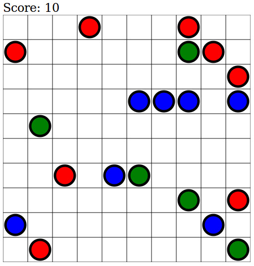

# Lines

A simple JavaScript/HTML5 game where your goal is to earn points by placing 5 or more colored balls in a row. The code is written with TDD (Test-Driven Development) methodology. [Jasmine](http://jasmine.github.io/) is used to run the tests.

A screenshot:  

